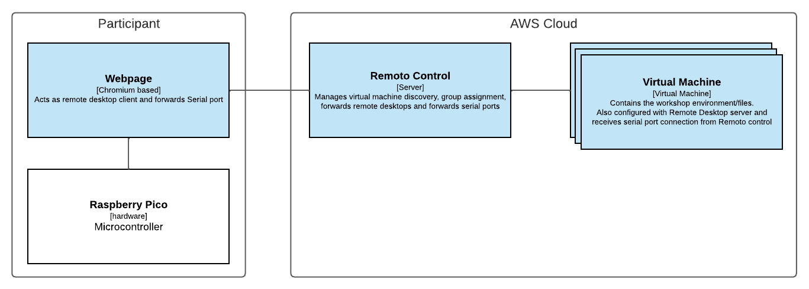

# Remoto; Workshops in the cloud

Using Remoto, workshop participants can access identical Virtual Machines from a webpage and forward Serial USB from their computer to the virtual machine. This avoids the need to provision and troubleshoot each participants workstation and they all work in an identical preconfigured environment without having to install anything on their own computers.

## Setting up locally

Use docker-compose

```
> docker-compose up

visit http://localhost:3000
```

## Setting up for production use

### Pre-requisites

- **Amazon Web Services** (AWS) account for hosting
- [**Terraform**](https://www.terraform.io/) installed for deploying the infrastructure
- **AWS S3 Bucket** called `terraform-remoto` to save Terraform state
- **AWS IAM** with admin rights for Terraform deployment
- **AWS AMI** with RDP server, Serial server and workshop contents (see below on how to create an AMI)

### Steps

Create a `secrets.auto.tfvars` file in the terraform folder. This file holds credentials and secrets and must not be shared.

Populate the following fields:

```hcl
# AWS IAM credentials
aws_iam_id     = 
aws_iam_secret = 
# Public SSH key, used to SSH into sandbox
ssh_pubkey     = 
```

Next create a `env.auto.tfvars` file in the terraform folder. This file contains deployment configuration. Images and AMI creation explained further below.

```hcl
# Workshop code used to enter the workshop (choose something)
remoto_workshop_code = 
# Admin code used to access the admin page (choose something)
remoto_admin_code    =
# Amount of virtual machine / sandboxes to be deployed (choose something)
remoto_sandbox_count =
# Image used for the remoto control server (docker image repository URL)
image_control        =
# Image used for the guacd server (docker image repository URL)
image_guacd          =
# AMI ID used for the virtual machines / sandboxes (AMI ID)
ami_sandbox          =
```

Now deploy the application using Terraform

```sh
> cd terraform
> terraform apply
```

After Terraform is done deploying you need to point a reverse proxy with HTTPS (required for serial port forwarding to work) to the Remoto Control IP Address. You can find the IP Address through `the AWS web interface > ECS > clusters > "Remoto" > "Control" > network info`

Unfortunately this is an ephemeral IP Address, if the Control service restarts the IP will change. This can be avoided by using an AWS Load Balancer, but that is not implement in the deployment yet.

Your Remoto deployment / workshop should now be accessible through the reverse proxy.

## Creating images

### Docker images

Two docker images are required: The Remoto Control image and the GuacD image.

The GuacD image is already published under the repository: `guacamole/guacd:1.4.0` on Docker hub.

The Remoto Control image can be built from this repository.

```sh
docker build -t <your_repository>/remoto -f docker/remoto.Dockerfile .
docker push <your_repository>/remoto
```

You might want to push both images to AWS ECR (Elastic Container Registry). The terraform deployment takes ECR permissions into consideration.

### AWS AMI

An AWS AMI can be created from a preconfigured EC2 instance.

- Create an EC2 instance with your preferred linux based operating system. 
- Install a desktop environment (for example: `xfce4`)
- Install remote desktop server (`xrdp`)
- Start and enable xrdp service: `systemctl enable --now xrdp`
- Install `Socat` (used for serial usb tunnel)
- Copy the `picolink.service` file from this repository to the system services folder (for example: `/usr/lib/systemd/system/picolink.service`)
- Start and enable the service: `systemctl enable --now picolink`
- Configure and copy files for the workshop (for example: install VSCode)
- [Create AMI through AWS web interface (click me)](https://docs.aws.amazon.com/toolkit-for-visual-studio/latest/user-guide/tkv-create-ami-from-instance.html)

## Architecture

### Simplified overview 

Remoto uses the Apache Guacamole project to tunnel the remote desktop protocol to a web-based viewer. In addition, Remoto also allows Serial Ports to be forwarded from the client's web browser to the remote desktop (Such as Raspberry Pico or Arduino).

The remote desktop is a virtual machine configured for the workshop in question. This machine can be scaled up for each participants or group. The Remoto Control server uses DNS service-discovery to find the virtual machines and register them.



### Serial port tunneling

USB Serial ports are tunneled from the participants environment to the virtual machine using: WebSerial --[Websocket]-> Control server --[TCP]-> Socat --> PTY

Using the WebSerial features available in Chromium browser, javascript can read and write to USB Serial ports. The webclient uses websockets to tunnel this serial port to the Remoto control server. The Control server connects the websocket over TCP to a SoCat server on the virtual machine. The socat server - at last - uses it to create a PTY on the linux VM.

## Credits

Thanks to https://github.com/accetto/ubuntu-vnc-xfce-g3 for the docker Sandbox image used in the docker-compose.

Thanks to the Apache Guacamole project for inventing the web remote desktop protocol; guac.

## License

EUPL-1.2

See [license.md](./license.md)